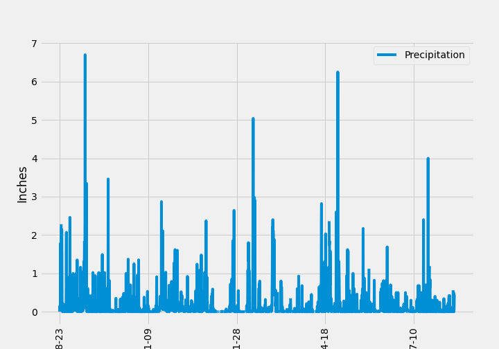
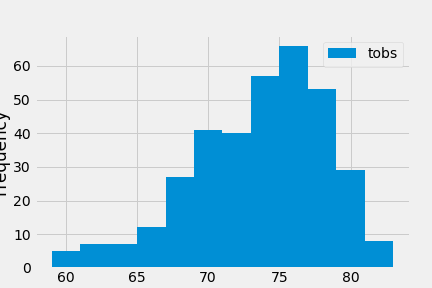

# Surf's Up! sqlalchemy-challenge

## Contents
* [Description](#description)
* [Climate Analysis and Exploration](#climate-analysis)
* [Precipitation Analysis](#precipitation-analysis)
* [Station Analysis](#station-analysis)
* [Hawaii Climate App (Flask API)](#hawaii-climate-app-flask-api)
* [Technologies](#technologies)

## Description
Congratulations! You've decided to treat yourself to a long holiday vacation in Honolulu, Hawaii! To help with your trip planning, you need to do some climate analysis on the area. 

This project analyzes the weather data collected at various weather stations throughout Hawaii.  The data is then used to predict the weather in a typical day for the days selected.

### Climate Analysis
Use Python and SQLAlchemy to do basic climate analysis and data exploration of your climate database. All of the following analysis should be completed using SQLAlchemy ORM queries, Pandas, and Matplotlib.

#### Precipitation Analysis
Design a Query to retrieve the passed years Precipitation Data selecting only the date and precipitation values.  The data is saved into a Pandas Dataframe and the index is set to the date column and sorted.  Plot the data using Matplotlib and calculate the summary statistics.

#### Station Analysis
Design a Query to calculate the total number of stations in a dataset.  List the stations and counts in descending order.  

Using the Station ID with the highest count calculate the Lowest temperature recorded, Highest temperature recorded, and the Average temperature of the stations Temperature Observations (tobs) over the last 12 months.

### Hawaii Climate App (Flask API)
Design a Flask API based on the queries that have been developed.

Use Flask to create routes for Precipitation, Station Information, and Temperature Observations for the start and end dates chosen by the user.

#### Technologies
- Python 3.7
- Pandas
- Jupyter Notebook
- [Flask](https://flask.palletsprojects.com/en/1.1.x/)
- [SQLite](https://www.sqlite.org/index.html)
- [SQLAlchemy](https://www.sqlalchemy.org)

